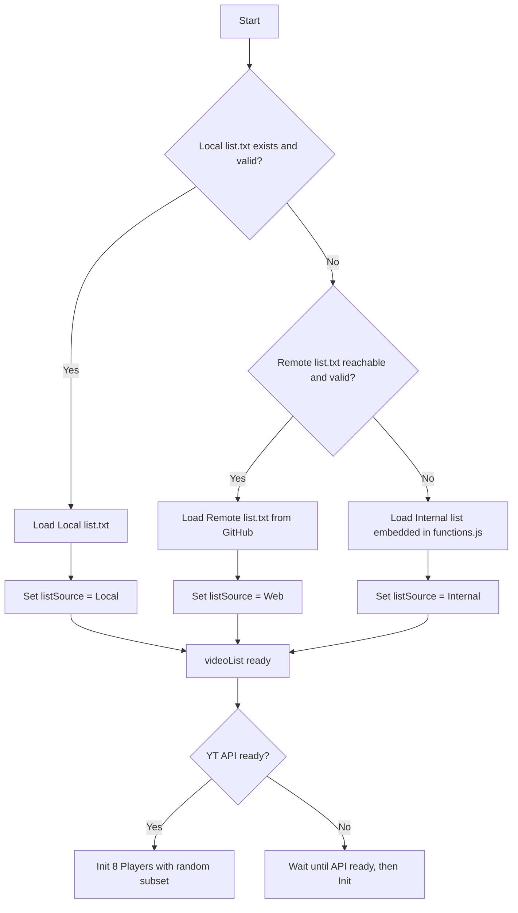

# 🎬 Multi‑Viewer YouTube Player

Ένα web‑based multi‑viewer που εμφανίζει και διαχειρίζεται πολλαπλά YouTube βίντεο ταυτόχρονα, με φυσική συμπεριφορά και πλήρη έλεγχο μέσω UI.

---

## ✨ Χαρακτηριστικά

### 📂 Διαχείριση Λίστας Βίντεο
- **Προεπιλογή** → Φόρτωση `list.txt` από τον ίδιο φάκελο με το `index.html` και `functions.js`.
- **Fallback #1** → Αν αποτύχει, φόρτωση από το remote αρχείο (https://deadmanwalkingto.github.io/MacrosDmW/player/list.txt)
- **Fallback #2** → Αν αποτύχει κι αυτό, χρήση της εσωτερικής λίστας 15 IDs που είναι ενσωματωμένα στο `functions.js`.
- **Reload List** → Κουμπί που ξαναφορτώνει τη λίστα και εμφανίζει μήνυμα με την πηγή και το πλήθος IDs. Όπως παρακάτω.
🔄 List reloaded — Source: Local (Total IDs = 25)

### 🎬 Διαχείριση Βίντεο
- 8 YouTube players σε grid (4×2 σε desktop, 2×4 σε mobile).
- Responsive layout με media queries.
- Τυχαία καθυστέρηση εκκίνησης (5–180s).
- Τυχαίο αρχικό seek (0–60s).
- Auto‑next → όταν τελειώσει ένα βίντεο, φορτώνεται αυτόματα άλλο από τη λίστα.
- Mid‑seek → κάθε 5–9 λεπτά γίνεται τυχαία μετακίνηση σε νέο σημείο (30–120s).
- Τυχαίες παύσεις:
- Μικρές (2–5s).
- Μεγάλες (15–30s).
- Playback quality ορίζεται σε “small”.

### 🔊 Έλεγχος Ήχου
- **Mute/Unmute All**
- Στο πρώτο click λειτουργεί ως Enable Sound, κάνει `unMute()` και δίνει τυχαία ένταση (10–30%).
- Στο επόμενο click ξανακάνει mute.
- **Randomize Volume All** → τυχαία ένταση (0–100%).
- **Normalize Volume All** → επαναφορά έντασης σε σταθερή τιμή (20%).

### 🖥️ Panel Ελέγχου
- ▶ Play All  
- ⏸ Pause All  
- ⏹ Stop All  
- ⏭ Next All  
- 🎲 Shuffle All  
- 🔁 Restart All  
- 🔇 Mute/Unmute All  
- 🔊 Randomize Volume All  
- 🎚 Normalize Volume All  
- 🌓 Dark/Light Mode Toggle  
- 🧹 Clear Logs (καθαρίζει το activity panel)  
- 🔄 Reload List (ανανεώνει τη λίστα IDs)

### 📊 Activity & Stats Panel
- **Activity panel** → εμφανίζει σε πραγματικό χρόνο όλα τα logs (start, pause, resume, seek, volume changes, auto‑next).
- **Stats panel** → μετρητές για AutoNext, Manual Next, Shuffle, Restart, Pauses, Volume Changes.

Ακολουθεί παράδειγμα logs.
🚀 Project start — HTML v1.2.1 | JS v1.3.3
✅ Players initialized (8) — Source: Local (Total IDs = 25) 
[12:34:56] Player 3 — ▶ Start after 45s, seek=12s : id=JFweOaiCoj4 
🧹 Logs cleared 
🔄 List reloaded — Source: Local (Total IDs = 25)

---

## 📂 Δομή Project

- **index.html** → Layout, κουμπιά, panels, σύνδεση με JS  
- **functions.js** → Όλη η λογική του player + τριπλό fallback λίστας + logs + stats  
- **list.txt** → Προεπιλεγμένη λίστα IDs (αν υπάρχει)  
- **README.md** → Περιγραφή χαρακτηριστικών  

---

## 🚀 Χρήση

1. Βάλε το `index.html`, το `functions.js` και (προαιρετικά) το `list.txt` στον ίδιο φάκελο.  
2. Άνοιξε το `index.html` σε browser με σύνδεση στο Internet.  
3. Το YouTube IFrame API φορτώνεται αυτόματα.  
4. Οι players ξεκινούν με τυχαία καθυστέρηση και συμπεριφορά.  
5. Χρησιμοποίησε τα κουμπιά για να ελέγξεις όλους τους players.  

---

## 🔁 Flowchart fallback λίστας

📌 Σημείωση
Αν υπάρχει list.txt στον φάκελο → χρησιμοποιείται αυτό.

Αν λείπει ή είναι άδειο → γίνεται fallback στο remote αρχείο GitHub.

Αν αποτύχει κι αυτό → χρησιμοποιείται η εσωτερική λίστα IDs.

Μπορείς να αλλάξεις ή να προσθέσεις IDs απευθείας στο list.txt ή στο internalList του functions.js.

Το activity panel κρατάει μόνο τα τελευταία 50 logs.
